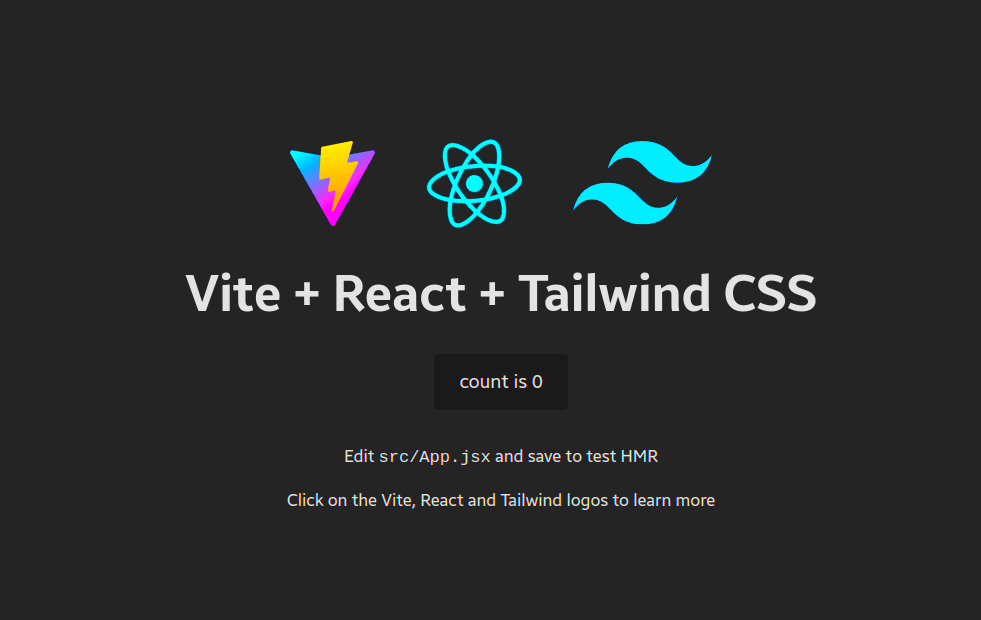

# React + Vite + TailwindCSS template



## Introduction

This is a Vite template that contains the minimal setup to make websites and web applications using **React** and **Tailwind CSS**.

## Features

- 📦 Works with **React** and **Tailwind** out of the box
- ⚙️ Uses SWC for the Fast Refresh
- ⚛️ All the logos are in SVG format to minimize bundle size
- 🌙 Light/Dark mode toggle
- 📱100% responsive

## Quick Setup

```bash
# clone the project
git clone https://github.com/SantosAlarcon/vite-react-tailwind [name of the directory]

# enter the project directory
cd [name of the project directory]

# install the dependencies
npm/yarn/pnpm/bun install

# start the development environment
npm/yarn/pnpm/bun dev
```

... And start coding!!! ⌨️

## Commands

| Command | Action |
| :------ | :----- |
| `npm/yarn/pnpm/bun install` | Install dependencies |
| `npm/yarn/pnpm/bun dev` | Start the development environment at `localhost:5173` |
| `npm/yarn/pnpm/bun build` | Build the production version |
| `npm/yarn/pnpm/bun preview` | Start the production environment at `localhost:4173` before deployment |
